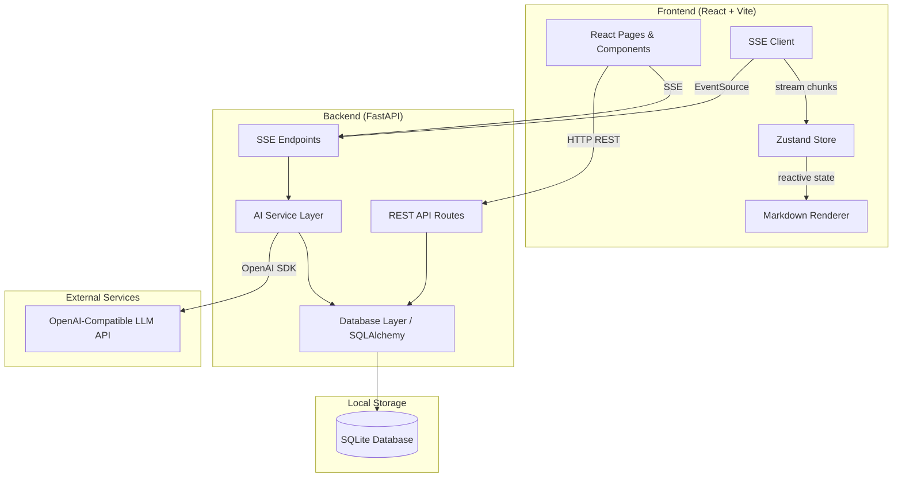
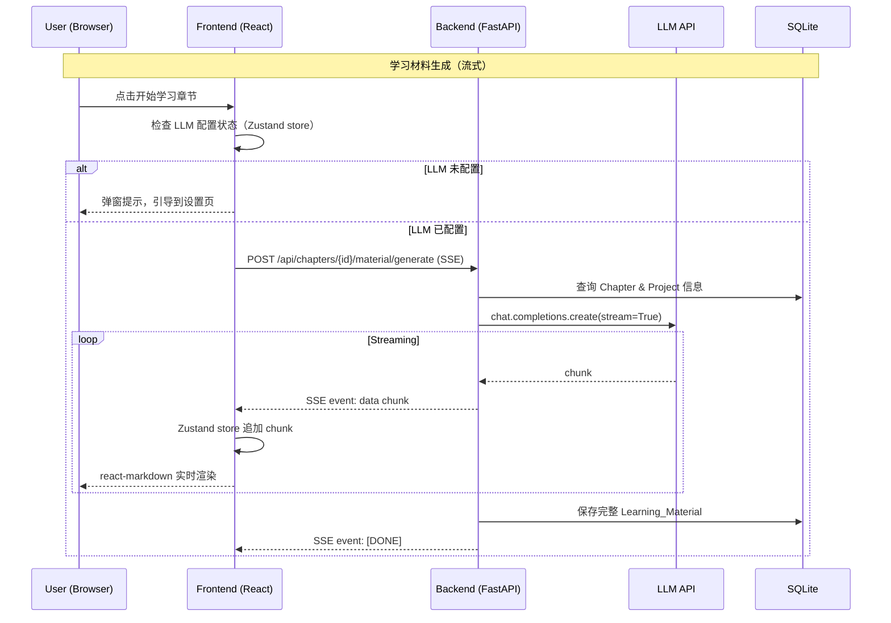
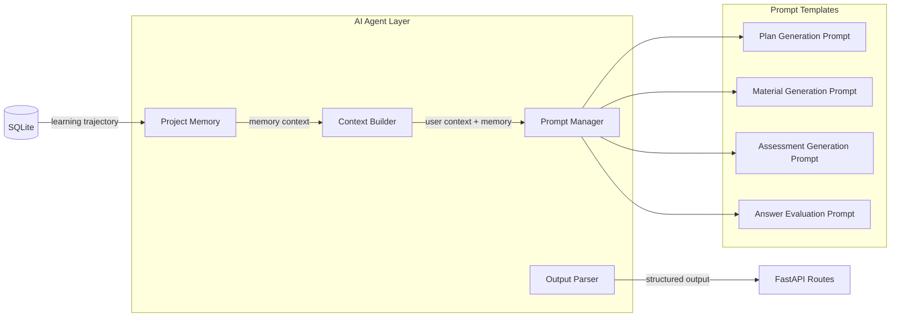
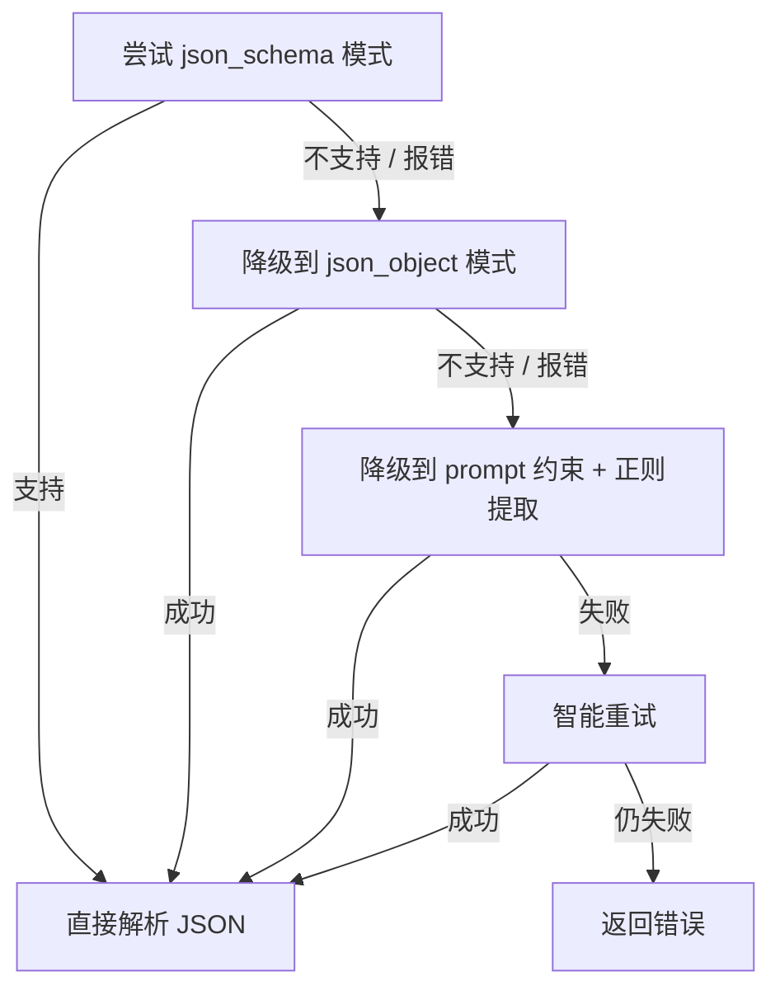
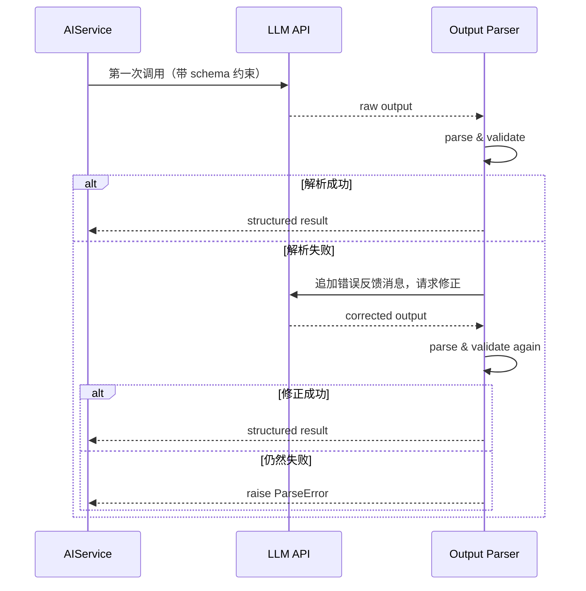
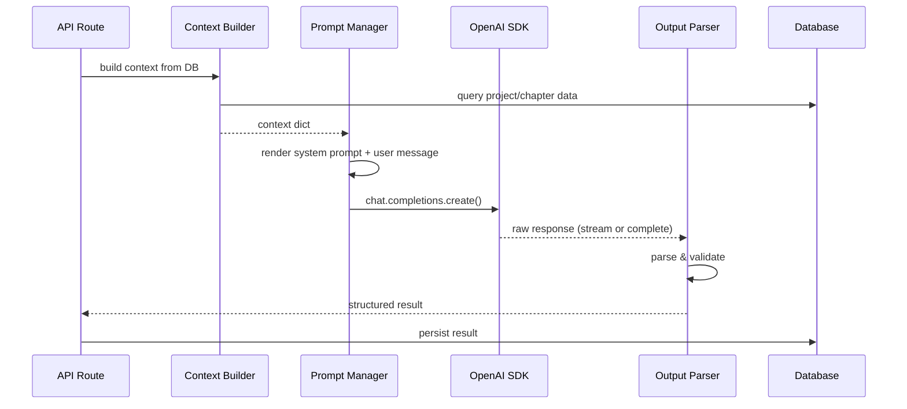
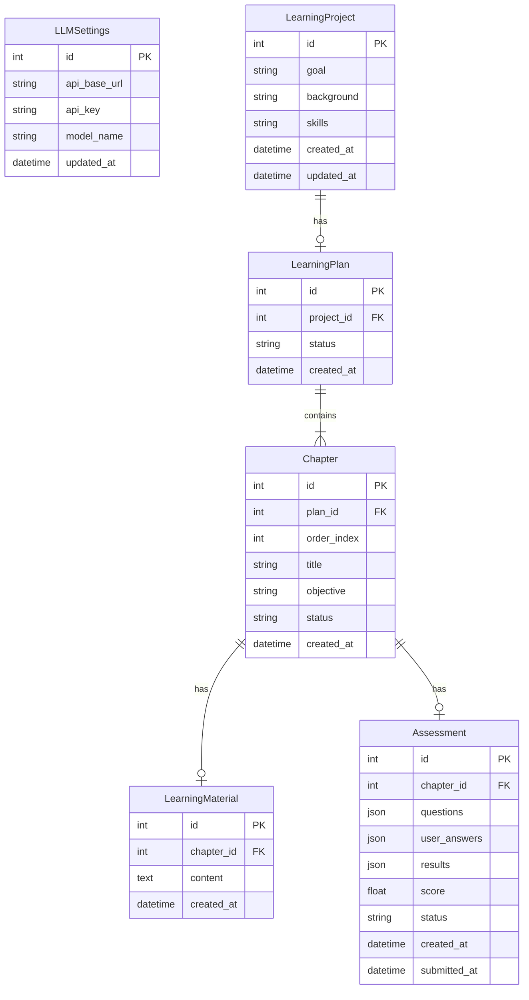

# DailyUp MVP 设计文档

## Overview

DailyUp MVP 实现核心学习闭环：创建项目 → AI 生成计划 → 动态学习材料 → 互动考核 → 进度追踪。

### 技术栈

| Layer | Technology | Rationale |
|-------|-----------|-----------|
| Frontend | React 18 + Vite + TypeScript | 成熟生态，快速开发，类型安全 |
| Routing | react-router-dom v6 | 声明式路由，支持嵌套路由和 loader |
| UI Library | Tailwind CSS + shadcn/ui | 完全可定制，适合"简约可爱"风格 |
| State Management | Zustand | 轻量、TypeScript 友好、无 boilerplate，适合 SSE 流式状态更新 |
| Markdown Rendering | react-markdown + remark-gfm + rehype-highlight | 学习材料核心渲染，支持 GFM 表格/代码高亮。需引入 highlight.js CSS 主题（推荐 `github`） |
| Animation | framer-motion + canvas-confetti | 页面过渡 + 完成庆祝动画 |
| Backend | Python 3.11+ FastAPI | AI 生态天然契合，async 支持好 |
| ORM | SQLAlchemy 2.0 (async) | 后续可无痛切换 PostgreSQL |
| Database | SQLite (local) | MVP 本地开发，零配置，使用 `create_all` 建表 |
| AI Integration | OpenAI Python SDK (custom base_url) | 兼容所有 OpenAI 协议的模型供应商 |
| Streaming | SSE (Server-Sent Events) | AI 内容流式输出 |
| API Protocol | REST API + SSE | CRUD 用 REST，AI 生成用 SSE |

### 设计原则

- **用户自配置 LLM**：前端设置页面填写 API Base URL、API Key、模型名称，后端统一走 OpenAI 兼容协议
- **无认证 MVP**：跳过登录注册，单用户模式
- **本地优先**：SQLite 本地存储，前后端本地运行调试，使用 SQLAlchemy `create_all` 自动建表（不引入 Alembic 迁移）
- **云端就绪**：架构设计保留后续部署到云平台的能力（ORM 抽象、环境变量配置）
- **配置前置守卫**：前端在 AI 相关操作前检查 LLM 配置状态，未配置时引导用户到设置页

## Architecture

### 系统架构图



### 请求流程



### 目录结构

```
dailyup/
├── frontend/                  # React + Vite
│   ├── src/
│   │   ├── pages/             # Page components
│   │   ├── components/        # Reusable UI components
│   │   ├── services/          # API client & SSE helpers
│   │   ├── stores/            # Zustand stores
│   │   ├── hooks/             # Custom React hooks (useSSE, useSettings, etc.)
│   │   ├── types/             # TypeScript type definitions
│   │   └── App.tsx
│   ├── package.json
│   └── vite.config.ts
├── backend/                   # Python FastAPI
│   ├── app/
│   │   ├── api/               # Route handlers
│   │   ├── models/            # SQLAlchemy models
│   │   ├── schemas/           # Pydantic request/response schemas
│   │   ├── services/          # Business logic & AI Agent
│   │   │   ├── ai_service.py        # Agent orchestration
│   │   │   ├── context_builder.py   # Context assembly
│   │   │   ├── output_parser.py     # LLM output parsing & validation
│   │   │   └── prompts/             # Prompt templates per role
│   │   │       ├── plan_prompt.py
│   │   │       ├── material_prompt.py
│   │   │       ├── assessment_prompt.py
│   │   │       └── evaluation_prompt.py
│   │   ├── database.py        # DB engine & session, create_all on startup
│   │   └── main.py            # FastAPI app entry
│   └── requirements.txt
└── README.md
```

### 开发环境配置

**启动方式：**

```bash
# Backend
cd backend
pip install -r requirements.txt
uvicorn app.main:app --reload --port 8000

# Frontend (另一个终端)
cd frontend
npm install
npm run dev   # 默认启动在 http://localhost:5173
```

**前后端联调（Vite Proxy）：**

推荐使用 Vite proxy 代理 API 请求到后端，避免 CORS 问题：

```typescript
// frontend/vite.config.ts
export default defineConfig({
  server: {
    proxy: {
      '/api': {
        target: 'http://localhost:8000',
        changeOrigin: true,
      }
    }
  }
})
```

前端代码中直接使用相对路径 `/api/...` 发起请求，开发环境下由 Vite 代理到后端。

**备用方案（CORS）：**

如果不使用 Vite proxy，后端需要添加 CORS 中间件：

```python
# backend/app/main.py
from fastapi.middleware.cors import CORSMiddleware

app.add_middleware(
    CORSMiddleware,
    allow_origins=["http://localhost:5173"],
    allow_methods=["*"],
    allow_headers=["*"],
)
```

## Components and Interfaces

### Backend API Endpoints

#### Learning Project API

| Method | Endpoint | Description | Request | Response |
|--------|----------|-------------|---------|----------|
| POST | `/api/projects` | 创建学习项目 | `CreateProjectRequest` | `ProjectResponse` |
| GET | `/api/projects` | 获取所有项目列表 | - | `List[ProjectResponse]` |
| GET | `/api/projects/{id}` | 获取项目详情（含进度） | - | `ProjectDetailResponse` |
| DELETE | `/api/projects/{id}` | 删除学习项目（级联删除计划、章节等） | - | `204 No Content` |

#### Learning Plan API

| Method | Endpoint | Description | Request | Response |
|--------|----------|-------------|---------|----------|
| POST | `/api/projects/{id}/plan` | 为项目生成学习计划 | - | SSE stream（progress + done）→ `PlanResponse` |
| GET | `/api/projects/{id}/plan` | 获取已生成的学习计划 | - | `PlanResponse` |

#### Chapter & Material API

| Method | Endpoint | Description | Request | Response |
|--------|----------|-------------|---------|----------|
| GET | `/api/chapters/{id}` | 获取章节详情 | - | `ChapterResponse` |
| GET | `/api/chapters/{id}/material` | 获取已有学习材料（不存在则 404） | - | `MaterialResponse` |
| POST | `/api/chapters/{id}/material/generate` | 为章节生成学习材料（流式） | - | SSE stream → `MaterialResponse` |
| POST | `/api/chapters/{id}/material/regenerate` | 重新生成学习材料（删除旧材料，流式） | - | SSE stream → `MaterialResponse` |

#### Assessment API

| Method | Endpoint | Description | Request | Response |
|--------|----------|-------------|---------|----------|
| POST | `/api/chapters/{id}/assessment` | 为章节生成考核 | - | SSE stream（progress + done）→ `AssessmentResponse` |
| POST | `/api/assessments/{id}/submit` | 提交考核答案 | `SubmitAnswerRequest` | SSE stream（progress + done）→ `AssessmentResultResponse` |

#### Settings API

| Method | Endpoint | Description | Request | Response |
|--------|----------|-------------|---------|----------|
| GET | `/api/settings` | 获取当前 LLM 配置（API Key 脱敏） | - | `SettingsResponse` |
| PUT | `/api/settings` | 更新 LLM 配置 | `UpdateSettingsRequest` | `SettingsResponse` |
| POST | `/api/settings/verify` | 验证 LLM 配置是否可用（发送测试请求） | - | `{"valid": bool, "message": str}` |

### Frontend Pages

| Page | Route | Description |
|------|-------|-------------|
| Home | `/` | 项目列表，展示所有项目及进度 |
| Create Project | `/projects/new` | 创建学习项目表单 |
| Project Detail | `/projects/:id` | 项目详情，学习计划概览，章节列表及进度 |
| Chapter Learning | `/chapters/:id` | 章节学习页面，展示流式生成的学习材料 |
| Chapter Assessment | `/chapters/:id/assessment` | 考核页面，答题并查看结果 |
| Settings | `/settings` | LLM API 配置页面（含连接测试按钮） |

### Frontend State Management (Zustand)

```typescript
// stores/settingsStore.ts
interface SettingsStore {
  isConfigured: boolean;       // LLM 是否已配置
  settings: Settings | null;
  fetchSettings: () => Promise<void>;
  updateSettings: (data: UpdateSettingsRequest) => Promise<void>;
  verifySettings: () => Promise<boolean>;
}

// stores/streamStore.ts
interface StreamStore {
  content: string;             // 累积的流式内容
  isStreaming: boolean;
  error: string | null;
  appendChunk: (chunk: string) => void;
  reset: () => void;
  setError: (msg: string) => void;
}

// stores/projectStore.ts
interface ProjectStore {
  projects: Project[];
  currentProject: ProjectDetail | null;
  fetchProjects: () => Promise<void>;
  fetchProject: (id: number) => Promise<void>;
  createProject: (data: CreateProjectRequest) => Promise<Project>;
  deleteProject: (id: number) => Promise<void>;
}
```

### Frontend API Client

前端使用原生 `fetch` 封装 API 调用（不引入 axios，减少依赖）：

```typescript
// services/api.ts
const API_BASE = '/api';  // Vite proxy 代理到后端

async function request<T>(path: string, options?: RequestInit): Promise<T> {
  const response = await fetch(`${API_BASE}${path}`, {
    headers: { 'Content-Type': 'application/json' },
    ...options,
  });
  if (!response.ok) {
    const error = await response.json().catch(() => ({}));
    throw new ApiError(response.status, error);
  }
  return response.json();
}

// Usage examples:
// request<ProjectResponse[]>('/projects')
// request<ProjectResponse>('/projects', { method: 'POST', body: JSON.stringify(data) })
```

统一错误处理：网络错误（`TypeError`）、HTTP 错误（4xx/5xx，解析 JSON body）、JSON 解析错误。Zustand store 的 async action 调用 `request()` 并处理错误。

### AI Service Layer

AIService 是 Agent 的编排层，协调 ContextBuilder、PromptManager、LLM 调用和 OutputParser。详细的 Agent 架构见下方 [AI Agent Design](#ai-agent-design) 章节。

```python
class AIService:
    """Orchestrates AI Agent: context building → prompt rendering →
    LLM call → output parsing. Uses OpenAI-compatible API."""

    def __init__(self, context_builder: ContextBuilder, output_parser: OutputParser):
        self.context_builder = context_builder
        self.output_parser = output_parser

    async def generate_learning_plan(
        self, project: LearningProject
    ) -> AsyncGenerator[str, None]:
        """Agent role: Plan Architect.
        Builds context from project, generates structured plan JSON via LLM.
        Yields SSE chunks, final chunk contains parsed plan."""

    async def generate_material(
        self, chapter: Chapter, project: LearningProject
    ) -> AsyncGenerator[str, None]:
        """Agent role: Content Tutor.
        Builds context from chapter + project, streams Markdown content."""

    async def regenerate_material(
        self, chapter: Chapter, project: LearningProject
    ) -> AsyncGenerator[str, None]:
        """Agent role: Content Tutor (regeneration).
        Deletes existing material, generates fresh content.
        Optionally includes previous material summary to avoid repetition."""

    async def generate_assessment(
        self, chapter: Chapter, material: LearningMaterial
    ) -> AsyncGenerator[str, None]:
        """Agent role: Assessment Designer.
        Builds context from chapter + material, generates structured assessment JSON.
        Supports multiple question types: choice, fill_blank, short_answer."""

    async def evaluate_answers(
        self, assessment: Assessment
    ) -> AsyncGenerator[str, None]:
        """Agent role: Answer Evaluator.
        Builds context from assessment, generates per-question evaluation.
        For short_answer questions, uses semantic similarity rather than exact match."""
```

### SSE Communication Protocol

Frontend uses `fetch` with `ReadableStream` reader (not `EventSource`, for better error handling and POST support). Backend sends:

```
event: chunk
data: {"content": "partial text..."}

event: progress
data: {"phase": "generating", "message": "正在生成第 3/5 章..."}

event: done
data: {"full_result": {...}, "saved": true}

event: error
data: {"code": "llm_connection_error", "message": "无法连接到 AI 服务", "retryable": true}
```

#### SSE 使用策略

不同 endpoint 对 SSE 事件的使用方式不同，取决于输出格式：

| Endpoint | 输出格式 | chunk 事件 | progress 事件 | done 事件 |
|----------|---------|-----------|--------------|----------|
| `POST /api/chapters/{id}/material/generate` | Streaming Markdown | 前端实时拼接渲染 | 可选 | 携带 `MaterialResponse` |
| `POST /api/chapters/{id}/material/regenerate` | Streaming Markdown | 前端实时拼接渲染 | 可选 | 携带 `MaterialResponse` |
| `POST /api/projects/{id}/plan` | Structured JSON | 仅后端内部接收，前端忽略 | 前端展示进度文案 | 携带完整 `PlanResponse` |
| `POST /api/chapters/{id}/assessment` | Structured JSON | 仅后端内部接收，前端忽略 | 前端展示进度文案 | 携带完整 `AssessmentResponse` |
| `POST /api/assessments/{id}/submit` | Structured JSON | 仅后端内部接收，前端忽略 | 前端展示进度文案 | 携带完整 `AssessmentResultResponse` |

**关键区别**：
- **Markdown 流式输出**（学习材料）：`chunk` 事件包含 Markdown 片段，前端通过 Zustand store 累积并用 react-markdown 实时渲染，实现打字机效果
- **结构化 JSON 输出**（计划/考核/评判）：LLM 在后端仍以流式方式接收（`stream=True`），但前端不需要拼接 chunk。前端只展示 `progress` 事件的进度文案（如"正在分析学习目标..."、"正在设计考核题目..."），在 `done` 事件到达时一次性接收完整的结构化数据

Frontend SSE client helper:

```typescript
// services/sse.ts
async function streamFetch(
  url: string,
  options: {
    method?: 'GET' | 'POST';
    body?: any;
    onChunk?: (content: string) => void;   // Optional: only needed for Markdown streaming
    onProgress?: (phase: string, message: string) => void;
    onDone: (result: any) => void;
    onError: (error: { code: string; message: string; retryable: boolean }) => void;
  }
): Promise<void> {
  // Uses fetch + ReadableStream for SSE parsing
  // Integrates with Zustand store via callbacks
}
```

## UI/UX Design

### 设计风格：简约不失可爱

整体风格追求干净、温暖、有亲和力的学习体验。不是冷硬的企业工具，也不是花哨的游戏化界面，而是让人觉得舒服、想打开来学习的产品。

### 设计系统

**配色方案：**

| Token | Color | Usage |
|-------|-------|-------|
| Primary | `#6366F1` (Indigo 500) | 主按钮、链接、进度条 |
| Primary Light | `#EEF2FF` (Indigo 50) | 卡片背景、hover 状态 |
| Accent | `#F59E0B` (Amber 500) | 成就、高亮、星标 |
| Success | `#10B981` (Emerald 500) | 完成状态、正确答案 |
| Error | `#EF4444` (Red 400) | 错误提示、错误答案 |
| Background | `#FAFAFA` | 页面背景 |
| Surface | `#FFFFFF` | 卡片、面板 |
| Text Primary | `#1F2937` (Gray 800) | 正文 |
| Text Secondary | `#6B7280` (Gray 500) | 辅助文字 |

**圆角与阴影：**
- 卡片圆角：`rounded-2xl` (16px)，柔和不生硬
- 按钮圆角：`rounded-xl` (12px)
- 阴影：`shadow-sm` 常态，`shadow-md` hover，避免重阴影

**字体：**
- 中文：系统默认（`-apple-system, "PingFang SC", "Microsoft YaHei"`）
- 英文/代码：`Inter` / `JetBrains Mono`
- 标题适当加大，正文 16px 保证阅读舒适度

**可爱元素：**
- 适当使用 emoji 作为状态图标：📚 学习中、✅ 已完成、🎯 目标、💡 知识点
- 进度环使用渐变色（indigo → emerald）
- 空状态页面配插画或 emoji 组合，避免冰冷的"暂无数据"

### UI 组件库

**Tailwind CSS + shadcn/ui**

选择理由：
- shadcn/ui 组件无样式锁定，完全可定制，适合实现"可爱"风格
- Tailwind 原子化 CSS 开发效率高，主题定制灵活
- 组件按需复制到项目中，不引入额外依赖

### 页面布局

**首页（项目列表）：**

```
┌─────────────────────────────────────────────┐
│  🎯 DailyUp                    ⚙️ Settings  │
├─────────────────────────────────────────────┤
│                                             │
│  我的学习项目                    [+ 新建项目] │
│                                             │
│  ┌──────────┐  ┌──────────┐  ┌──────────┐  │
│  │ 📚       │  │ 📚       │  │ 📚       │  │
│  │ Python   │  │ 机器学习  │  │ 日语 N2  │  │
│  │ 入门     │  │ 基础     │  │          │  │
│  │          │  │          │  │          │  │
│  │ ████░░ 60%│ │ ██░░░░ 30%│ │ ░░░░░░ 0% │ │
│  │ 3/5 章节  │  │ 2/7 章节  │  │ 未开始    │  │
│  └──────────┘  └──────────┘  └──────────┘  │
│                                             │
│  ⚠️ 未配置 AI 服务，请先前往设置页面配置     │ (条件展示)
│                                             │
└─────────────────────────────────────────────┘
```

**项目详情（学习计划）：**

```
┌─────────────────────────────────────────────┐
│  ← 返回    Python 入门     🗑️    进度 60%   │
├─────────────────────────────────────────────┤
│                                             │
│  学习目标：掌握 Python 基础语法和常用库      │
│                                             │
│  章节列表                                    │
│  ┌─────────────────────────────────────┐    │
│  │ ✅ 第1章 Python 环境搭建    得分 90% │    │
│  ├─────────────────────────────────────┤    │
│  │ ✅ 第2章 变量与数据类型     得分 85% │    │
│  ├─────────────────────────────────────┤    │
│  │ 📚 第3章 控制流与函数       学习中   │    │
│  ├─────────────────────────────────────┤    │
│  │ 🔒 第4章 面向对象编程       未开始   │    │
│  ├─────────────────────────────────────┤    │
│  │ 🔒 第5章 常用标准库         未开始   │    │
│  └─────────────────────────────────────┘    │
│                                             │
└─────────────────────────────────────────────┘
```

**章节学习页面：**

```
┌─────────────────────────────────────────────┐
│  ← 返回计划    第3章 控制流与函数            │
├─────────────────────────────────────────────┤
│                                             │
│  ┌─────────────────────────────────────┐    │
│  │                                     │    │
│  │  AI 生成的学习材料                   │    │
│  │  （react-markdown 渲染，流式效果）    │    │
│  │                                     │    │
│  │  ## 条件语句                         │    │
│  │  Python 使用 if/elif/else...        │    │
│  │  ▊ (typing cursor)                  │    │
│  │                                     │    │
│  └─────────────────────────────────────┘    │
│                                             │
│     [🔄 重新生成]        [📝 开始考核]       │
│                                             │
└─────────────────────────────────────────────┘
```

### 微交互动画

| 场景 | 动画 | 实现 |
|------|------|------|
| 卡片 hover | 轻微上浮 + 阴影加深 | `hover:-translate-y-1 hover:shadow-md transition-all` |
| 进度条更新 | 平滑过渡 | `transition-all duration-500 ease-out` |
| AI 流式输出 | 打字机光标闪烁 | CSS `@keyframes blink` on cursor element |
| 完成章节 | 🎉 confetti 小动画 | canvas-confetti 库（轻量） |
| 答题正确/错误 | 绿色/红色渐入 + 图标 | `animate-in fade-in` with color |
| 页面切换 | 淡入 | React Router + `framer-motion` 简单 fade |
| 删除确认 | 弹窗淡入 + 背景模糊 | shadcn/ui AlertDialog |

## AI Agent Design

### Agent 架构

DailyUp 的 AI Agent 不是简单的 API 调用封装，而是一个具备上下文感知和结构化输出能力的智能体。Agent 在每个场景中承担不同的角色，通过 System Prompt + 用户上下文 + 输出约束 三层设计实现个性化内容生成。



### Agent 角色与 Prompt 策略

每个 AI 功能场景对应一个 Agent 角色，使用独立的 System Prompt 模板：

| Agent Role | 场景 | System Prompt 核心指令 | 输出格式 |
|-----------|------|----------------------|---------|
| Plan Architect | 生成学习计划 | "你是一位教育规划专家。根据用户的学习目标、专业背景和已有技能，设计一个循序渐进的学习计划。跳过用户已掌握的基础内容。" | Structured JSON |
| Content Tutor | 生成学习材料 | "你是一位个性化教学导师。根据章节目标和用户背景，生成包含讲解、概念说明和实例的学习材料。用用户能理解的语言和类比。" | Streaming Markdown |
| Assessment Designer | 生成考核题目 | "你是一位考核设计专家。根据章节内容生成覆盖核心知识点的考核题目，包含选择题和简答题，难度匹配用户水平。" | Structured JSON |
| Answer Evaluator | 评判答案 | "你是一位耐心的评阅老师。逐题评判用户答案，选择题判断对错，简答题进行语义评估，给出正确答案和详细解析。" | Structured JSON (streaming) |

### Context Builder（上下文构建器）与项目级 Memory

Agent 的个性化能力依赖于上下文构建。Context Builder 不仅拼接静态信息，还从 DB 中提取用户在当前项目中的**学习轨迹**（已完成章节、考核得分、薄弱知识点），作为 Agent 的"记忆"注入 prompt。

**项目级 Memory 策略（MVP）：**
- 每次 AI 调用前，从 DB 查询当前项目的完整学习状态
- 包括：已完成章节列表、各章节考核得分、低分章节的知识点
- 将这些信息结构化后注入 prompt 的 user context 部分
- Agent 据此调整内容难度、补充薄弱知识点、避免重复已掌握内容

```python
class ContextBuilder:
    """Builds LLM prompt context with project-level memory from DB."""

    def build_learning_memory(self, project: LearningProject) -> dict:
        """Query DB for project learning trajectory.
        Returns: {
            completed_chapters: [{title, score}],
            weak_areas: [chapter titles with score < threshold],
            current_progress: float
        }"""

    def build_plan_context(self, project: LearningProject) -> dict:
        """Assemble context for plan generation.
        Returns: {goal, background, skills}"""

    def build_material_context(
        self, chapter: Chapter, project: LearningProject
    ) -> dict:
        """Assemble context for material generation.
        Includes learning memory for personalization.
        Returns: {chapter_title, chapter_objective, project_goal,
                  user_background, user_skills, learning_memory}"""

    def build_assessment_context(
        self, chapter: Chapter, material: LearningMaterial,
        project: LearningProject
    ) -> dict:
        """Assemble context for assessment generation.
        Includes learning memory to adjust difficulty.
        Returns: {chapter_title, chapter_objective, material_summary,
                  user_background, learning_memory}"""

    def build_evaluation_context(
        self, assessment: Assessment
    ) -> dict:
        """Assemble context for answer evaluation.
        Returns: {questions, user_answers, chapter_context}"""
```

**Memory 注入示例（材料生成 prompt 片段）：**

```
## 用户学习轨迹
- 已完成章节：第1章（得分 0.9）、第2章（得分 0.6）
- 薄弱领域：第2章"递归与分治"（得分较低）
- 整体进度：40%

请在本章内容中适当回顾"递归与分治"的相关概念，帮助用户巩固薄弱知识点。
```

### Structured Output（结构化输出）与 Fallback 策略

对于需要结构化数据的场景（学习计划、考核题目、答案评判），Agent 使用 JSON Schema 约束 LLM 输出。

**Fallback 策略（兼容不同模型能力）：**

不是所有 OpenAI 兼容 API 都支持 `response_format: json_schema`。Agent 采用三级降级策略：



1. **Level 1**: `response_format={"type": "json_schema", "json_schema": {...}}` — OpenAI GPT-4o 等原生支持
2. **Level 2**: `response_format={"type": "json_object"}` — 大部分国内模型支持
3. **Level 3**: Prompt 中明确要求 JSON 格式 + 正则提取 `\{[\s\S]*\}` — 兜底方案

```python
# Plan generation output schema
PLAN_OUTPUT_SCHEMA = {
    "type": "object",
    "properties": {
        "chapters": {
            "type": "array",
            "items": {
                "type": "object",
                "properties": {
                    "title": {"type": "string"},
                    "objective": {"type": "string"}
                },
                "required": ["title", "objective"]
            },
            "minItems": 1
        }
    },
    "required": ["chapters"]
}

# Assessment output schema — supports multiple question types
ASSESSMENT_OUTPUT_SCHEMA = {
    "type": "object",
    "properties": {
        "questions": {
            "type": "array",
            "items": {
                "type": "object",
                "properties": {
                    "type": {
                        "type": "string",
                        "enum": ["choice", "fill_blank", "short_answer"]
                    },
                    "question": {"type": "string"},
                    "options": {
                        "type": "array",
                        "items": {"type": "string"},
                        "description": "Required for choice type, empty for others"
                    },
                    "correct_answer": {"type": "string"},
                    "explanation": {"type": "string"}
                },
                "required": ["type", "question", "correct_answer"]
            },
            "minItems": 1
        }
    },
    "required": ["questions"]
}

# Evaluation output schema
EVALUATION_OUTPUT_SCHEMA = {
    "type": "object",
    "properties": {
        "results": {
            "type": "array",
            "items": {
                "type": "object",
                "properties": {
                    "correct": {"type": "boolean"},
                    "correct_answer": {"type": "string"},
                    "explanation": {"type": "string"}
                },
                "required": ["correct", "correct_answer", "explanation"]
            }
        },
        "total_score": {"type": "number", "minimum": 0, "maximum": 1}
    },
    "required": ["results", "total_score"]
}
```

### Output Parser（输出解析器）与智能重试

LLM 输出不总是完美的 JSON。Output Parser 负责：

1. 从流式响应中提取完整 JSON（处理 markdown code block 包裹等情况）
2. 校验 JSON 结构是否符合 schema
3. **智能重试**：解析失败时，将错误输出作为上下文反馈给 LLM（"你上次输出的 JSON 格式不对，具体错误是 X，请修正"），显著提高重试成功率
4. 最终失败时返回结构化错误

```python
class OutputParser:
    """Parses and validates LLM structured output with smart retry."""

    def parse_json_response(self, raw: str, schema: dict) -> dict:
        """Extract JSON from LLM response, validate against schema.
        Handles markdown code blocks, trailing text, etc."""

    def parse_streaming_markdown(self, chunks: AsyncGenerator) -> AsyncGenerator:
        """Pass through markdown chunks for streaming display."""

    async def retry_with_feedback(
        self, llm_client, messages: list, raw_output: str,
        parse_error: str, schema: dict
    ) -> dict:
        """Smart retry: append the failed output and error message
        to the conversation, ask LLM to fix it.
        Example feedback message:
        '你上次的输出无法解析为有效 JSON。错误：{parse_error}。
         你的输出是：{raw_output[:500]}。请重新输出正确的 JSON。'"""
```

**智能重试流程：**



### Agent 调用流程



### Prompt 管理

Prompt 模板存储为 Python 字符串常量，使用 f-string 或 Jinja2 模板注入上下文变量。MVP 阶段不需要复杂的 prompt 版本管理，但保持模板与业务逻辑分离：

```
backend/app/
├── services/
│   ├── ai_service.py        # AIService class (orchestration)
│   ├── context_builder.py   # ContextBuilder
│   ├── output_parser.py     # OutputParser
│   └── prompts/
│       ├── plan_prompt.py       # Plan generation prompt template
│       ├── material_prompt.py   # Material generation prompt template
│       ├── assessment_prompt.py # Assessment generation prompt template
│       └── evaluation_prompt.py # Answer evaluation prompt template
```

## Data Models

### ER Diagram



### SQLAlchemy Models

```python
class LLMSettings(Base):
    __tablename__ = "llm_settings"
    id: Mapped[int] = mapped_column(primary_key=True)
    api_base_url: Mapped[str] = mapped_column(String(500), default="")
    api_key: Mapped[str] = mapped_column(String(500), default="")
    model_name: Mapped[str] = mapped_column(String(200), default="")
    updated_at: Mapped[datetime] = mapped_column(default=func.now(), onupdate=func.now())

class LearningProject(Base):
    __tablename__ = "learning_projects"
    id: Mapped[int] = mapped_column(primary_key=True)
    goal: Mapped[str] = mapped_column(Text, nullable=False)
    background: Mapped[str] = mapped_column(Text, default="")
    skills: Mapped[str] = mapped_column(Text, default="")
    created_at: Mapped[datetime] = mapped_column(default=func.now())
    updated_at: Mapped[datetime] = mapped_column(default=func.now(), onupdate=func.now())
    # cascade delete: deleting project removes plan → chapters → materials & assessments
    plan: Mapped[Optional["LearningPlan"]] = relationship(
        back_populates="project", cascade="all, delete-orphan"
    )

class LearningPlan(Base):
    __tablename__ = "learning_plans"
    id: Mapped[int] = mapped_column(primary_key=True)
    project_id: Mapped[int] = mapped_column(ForeignKey("learning_projects.id"), unique=True)
    status: Mapped[str] = mapped_column(String(20), default="generating")  # generating | completed | failed
    created_at: Mapped[datetime] = mapped_column(default=func.now())
    project: Mapped["LearningProject"] = relationship(back_populates="plan")
    chapters: Mapped[List["Chapter"]] = relationship(
        back_populates="plan", order_by="Chapter.order_index",
        cascade="all, delete-orphan"
    )

class Chapter(Base):
    __tablename__ = "chapters"
    id: Mapped[int] = mapped_column(primary_key=True)
    plan_id: Mapped[int] = mapped_column(ForeignKey("learning_plans.id"))
    order_index: Mapped[int] = mapped_column(Integer)
    title: Mapped[str] = mapped_column(String(500))
    objective: Mapped[str] = mapped_column(Text, default="")
    status: Mapped[str] = mapped_column(String(20), default="not_started")  # not_started | learning | completed
    created_at: Mapped[datetime] = mapped_column(default=func.now())
    plan: Mapped["LearningPlan"] = relationship(back_populates="chapters")
    material: Mapped[Optional["LearningMaterial"]] = relationship(
        back_populates="chapter", cascade="all, delete-orphan", uselist=False
    )
    assessment: Mapped[Optional["Assessment"]] = relationship(
        back_populates="chapter", cascade="all, delete-orphan", uselist=False
    )

class LearningMaterial(Base):
    __tablename__ = "learning_materials"
    id: Mapped[int] = mapped_column(primary_key=True)
    chapter_id: Mapped[int] = mapped_column(ForeignKey("chapters.id"), unique=True)
    content: Mapped[str] = mapped_column(Text)
    created_at: Mapped[datetime] = mapped_column(default=func.now())
    chapter: Mapped["Chapter"] = relationship(back_populates="material")

class Assessment(Base):
    __tablename__ = "assessments"
    id: Mapped[int] = mapped_column(primary_key=True)
    chapter_id: Mapped[int] = mapped_column(ForeignKey("chapters.id"), unique=True)
    questions: Mapped[dict] = mapped_column(JSON)  # [{type, question, options?, correct_answer, explanation?}]
    user_answers: Mapped[Optional[dict]] = mapped_column(JSON, nullable=True)
    results: Mapped[Optional[dict]] = mapped_column(JSON, nullable=True)  # [{correct, correct_answer, explanation}]
    score: Mapped[Optional[float]] = mapped_column(Float, nullable=True)
    status: Mapped[str] = mapped_column(String(20), default="not_started")  # not_started | generated | submitted
    created_at: Mapped[datetime] = mapped_column(default=func.now())
    submitted_at: Mapped[Optional[datetime]] = mapped_column(nullable=True)
    chapter: Mapped["Chapter"] = relationship(back_populates="assessment")
```

### Database Initialization

MVP 使用 SQLAlchemy `create_all` 在应用启动时自动建表，不引入 Alembic 迁移工具：

```python
# database.py
import os
from sqlalchemy.ext.asyncio import create_async_engine, async_sessionmaker
from sqlalchemy.orm import DeclarativeBase

# 基于 backend/ 目录计算绝对路径，避免相对路径在不同启动目录下行为不一致
BASE_DIR = os.path.dirname(os.path.dirname(os.path.abspath(__file__)))
DATABASE_URL = f"sqlite+aiosqlite:///{os.path.join(BASE_DIR, 'dailyup.db')}"

engine = create_async_engine(DATABASE_URL, echo=False)
async_session = async_sessionmaker(engine, expire_on_commit=False)

class Base(DeclarativeBase):
    pass

async def init_db():
    """Called on FastAPI startup event. Creates all tables if not exist.
    Also ensures the singleton LLMSettings record exists."""
    async with engine.begin() as conn:
        await conn.run_sync(Base.metadata.create_all)
    # Ensure singleton LLMSettings record
    async with async_session() as session:
        from app.models import LLMSettings
        result = await session.get(LLMSettings, 1)
        if not result:
            session.add(LLMSettings(id=1))
            await session.commit()
```

**Settings 单例模式**：`LLMSettings` 表始终只有一条记录（id=1）。GET/PUT `/api/settings` 不需要 ID 参数，直接操作这条唯一记录。

### Pydantic Schemas (Key Examples)

```python
class CreateProjectRequest(BaseModel):
    goal: str = Field(..., min_length=1, description="学习目标，不能为空")
    background: str = Field(default="", description="专业知识背景")
    skills: str = Field(default="", description="当前已有技能")

    @field_validator("goal")
    @classmethod
    def goal_not_whitespace(cls, v: str) -> str:
        if not v.strip():
            raise ValueError("学习目标不能为空或纯空白字符")
        return v.strip()

class ProjectResponse(BaseModel):
    id: int
    goal: str
    background: str
    skills: str
    progress: float  # 0.0 ~ 1.0, computed from chapters
    created_at: datetime

class ChapterSummary(BaseModel):
    id: int
    order_index: int
    title: str
    objective: str
    status: str  # not_started | learning | completed
    score: float | None  # assessment score if completed

class PlanResponse(BaseModel):
    id: int
    project_id: int
    status: str
    chapters: List[ChapterSummary]

class SettingsResponse(BaseModel):
    api_base_url: str
    api_key_masked: str  # e.g. "sk-****abcd" — never expose full key
    model_name: str
    is_configured: bool  # True if all three fields are non-empty

class UpdateSettingsRequest(BaseModel):
    api_base_url: str = Field(..., min_length=1)
    api_key: str = Field(..., min_length=1)
    model_name: str = Field(..., min_length=1)

class SubmitAnswerRequest(BaseModel):
    answers: list[str]  # 按题目顺序的答案列表
    # 选择题：选项文本（如 "Python 是解释型语言"）
    # 填空题：填写的文本
    # 简答题：回答的文本
```

## Correctness Properties

*A property is a characteristic or behavior that should hold true across all valid executions of a system — essentially, a formal statement about what the system should do. Properties serve as the bridge between human-readable specifications and machine-verifiable correctness guarantees.*

### Property 1: Project creation round-trip

*For any* valid project with a non-empty goal, background, and skills, creating the project via the API and then retrieving it should return a project with identical goal, background, and skills values.

**Validates: Requirements 1.1, 1.4**

### Property 2: Invalid goal rejection with field identification

*For any* string that is empty or composed entirely of whitespace characters, submitting it as the goal field in a project creation request should be rejected, and the error response should identify "goal" as the invalid field.

**Validates: Requirements 1.2, 1.3**

### Property 3: Learning plan structure invariant

*For any* successfully generated learning plan, the plan must contain at least one chapter, and every chapter must have a non-empty title and a non-empty objective, with chapters ordered by their index.

**Validates: Requirements 2.1, 2.2**

### Property 4: Material generation produces non-empty content

*For any* chapter with a valid objective within a valid project, generating learning material should produce a non-empty content string that is persisted and associated with that chapter.

**Validates: Requirements 3.1**

### Property 5: Assessment structure invariant

*For any* successfully generated assessment for a chapter, the assessment must contain at least one question, and each question must have a type field (one of "choice", "fill_blank", "short_answer"), a question text, and a correct answer. Questions of type "choice" must additionally have a non-empty list of options.

**Validates: Requirements 4.1**

### Property 6: Evaluation completeness

*For any* set of assessment questions and submitted user answers, the evaluation result must contain a result entry for every question (each with a correctness flag, the correct answer, and an explanation), and a total score between 0.0 and 1.0 (inclusive).

**Validates: Requirements 4.3, 4.4**

### Property 7: Chapter status transition on assessment submission

*For any* chapter, after a user submits answers for that chapter's assessment, the chapter's status must be updated to "completed".

**Validates: Requirements 5.1, 5.2**

### Property 8: Progress percentage calculation

*For any* learning project with N chapters (N > 0) where M chapters have status "completed", the project's progress percentage must equal M / N.

**Validates: Requirements 5.3**

### Property 9: Project deletion cascade

*For any* learning project that is deleted, all associated learning plans, chapters, learning materials, and assessments must also be deleted. No orphan records should remain.

**Validates: Data integrity**

### Property 10: API Key non-exposure

*For any* GET request to the settings endpoint, the response must never contain the full API key. The returned `api_key_masked` field must mask all but the last 4 characters.

**Validates: Security**

## Error Handling

### AI Service Errors

| Scenario | Handling | User Experience |
|----------|----------|-----------------|
| LLM API unreachable | Catch `ConnectionError`, return SSE error event | 显示"无法连接到 AI 服务，请检查 API 配置"，提供重试按钮 |
| LLM API key invalid | Catch `AuthenticationError` (401) | 显示"API Key 无效，请在设置中更新" |
| LLM response malformed | Catch JSON parse error, smart retry once | 自动重试一次（带错误反馈），仍失败则显示错误并提供重试 |
| LLM rate limited | Catch 429, return with retry-after | 显示"请求过于频繁，请稍后重试" |
| LLM stream interrupted | Detect incomplete stream | 保存已接收内容，提示用户可重试继续 |
| LLM settings not configured | Check `is_configured` before AI calls | 前端守卫拦截，引导用户到设置页面配置 API |
| LLM context too long | Catch context length error | 显示"学习内容过长，请尝试缩小学习目标范围" |

### Data Validation Errors

| Scenario | Handling | HTTP Status |
|----------|----------|-------------|
| Empty/whitespace goal | Pydantic `field_validator` strips and rejects | 422 with field-level error |
| Project not found | DB query returns None | 404 |
| Plan already exists for project | Check before generation | 409 Conflict |
| Chapter has no plan | FK constraint | 404 |
| Assessment already submitted | Check status before submit | 409 Conflict |
| Delete non-existent project | DB query returns None | 404 |

### SSE Error Protocol

When an error occurs during streaming:

```
event: error
data: {"code": "llm_connection_error", "message": "无法连接到 AI 服务", "retryable": true}
```

Error codes:

| Code | Description | Retryable |
|------|-------------|-----------|
| `llm_connection_error` | Cannot reach LLM API | true |
| `llm_auth_error` | Invalid API key | false (redirect to settings) |
| `llm_rate_limited` | Rate limited by provider | true (with delay) |
| `llm_parse_error` | Failed to parse LLM output after retry | true |
| `llm_context_too_long` | Input exceeds model context window | false |
| `internal_error` | Unexpected server error | true |

Frontend handles `error` events by displaying the message and showing a retry button if `retryable` is true. For `llm_auth_error`, frontend shows a link to the settings page.

## Testing Strategy

### Dual Testing Approach

DailyUp MVP uses both unit tests and property-based tests for comprehensive coverage:

- **Unit tests**: Verify specific examples, edge cases, integration points, and error conditions
- **Property-based tests**: Verify universal properties across randomly generated inputs

### Technology

| Concern | Tool |
|---------|------|
| Backend unit tests | pytest |
| Backend property tests | Hypothesis (Python) |
| Frontend unit tests | Vitest + React Testing Library |
| Frontend property tests | fast-check (TypeScript) |
| API integration tests | pytest + httpx (TestClient) |

### Property-Based Testing Configuration

- Each property test runs a minimum of **100 iterations**
- Each test is tagged with a comment referencing the design property:
  - Format: `Feature: dailyup-learning-app, Property {number}: {property_text}`
- Each correctness property is implemented by a **single** property-based test
- Use Hypothesis strategies to generate random valid/invalid inputs

### Test Plan

#### Backend Property Tests (Hypothesis)

| Property | Test Description | Strategy |
|----------|-----------------|----------|
| P1: Project round-trip | Generate random goal/background/skills, create via API, retrieve and compare | `st.text(min_size=1)` for goal, `st.text()` for others |
| P2: Invalid goal rejection | Generate whitespace-only strings, verify 422 with "goal" in error | `st.from_regex(r'^\s*$')` |
| P3: Plan structure | Mock AI to return random valid plan JSON, verify structure invariants | Custom strategy for plan JSON |
| P4: Material non-empty | Mock AI to return random non-empty strings, verify persistence | `st.text(min_size=1)` |
| P5: Assessment structure | Mock AI to return random assessment JSON with mixed question types, verify structure | Custom strategy for assessment JSON with type field |
| P6: Evaluation completeness | Generate random questions + answers, mock AI evaluation, verify result structure | Custom strategy for Q&A pairs |
| P7: Status transition | Create chapter, submit assessment, verify status = "completed" | Random chapter data |
| P8: Progress calculation | Generate N chapters with random statuses, verify progress = completed/total | `st.lists(st.sampled_from(["not_started", "learning", "completed"]))` |
| P9: Deletion cascade | Create project with plan/chapters/materials, delete project, verify all gone | Random project data |
| P10: API Key masking | Generate random API keys, save via settings, verify GET never returns full key | `st.text(min_size=5, max_size=100)` |

#### Backend Unit Tests (pytest)

- Project CRUD operations with specific examples (including DELETE with cascade)
- LLM settings CRUD with API key masking verification
- Settings verify endpoint (mock LLM connection test)
- Error responses for missing projects (404)
- Error responses for duplicate plans (409)
- SSE stream format validation (chunk, progress, done, error events)
- AI service error handling (mock connection errors, auth errors, context length errors)
- Material regeneration (verify old material replaced)

#### Frontend Property Tests (fast-check)

- Progress bar calculation matches P8 logic
- Project list rendering with random project data
- API key masking display logic

#### Frontend Unit Tests (Vitest)

- Component rendering for each page
- SSE client with Zustand store integration
- Form validation on project creation (whitespace-only goal rejection)
- Settings form validation and connection test button
- LLM configuration guard (redirect to settings when unconfigured)
- Navigation flow between pages
- Delete confirmation dialog flow
- Material regeneration button behavior
